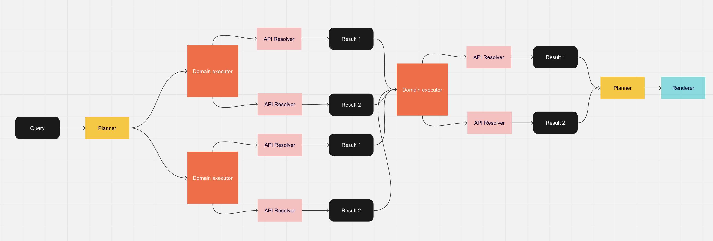

# Enterprise-MultiHop-QA-bot

This is a demo repository for how to approach building a enterprise QA bot. This is a modular and hierarchical design, which would scale better than a flat design.

This repo has two enterprise domains - hr and tickets   

Each domain has an executor and api_resolver  

Executor is a langchain tool. Executor exposes the overall functionality of the module.

API resolver is a langchain tool too. It is responsible for making the right api calls to the external services. API resolver makes the actual api calls to the external services. To demonstrate this, we've used few py functions that mock the api calls.  

All the apis for a domain are under domains/\<domain\>/apis directory. They're decorated using python decorators so that they can be directly to the registry.

All langchain tools need a description - which tells an LLM what it does.  

Description for the executor is handwritten. We can also generate it by taking the summary of API resolver description. As this is once per domain, it's not tough to scale. This description roughly states what the domain does.

For example, description for tickets domains is 

```
This is a tool dedicated to answering questions about a company's ticketing system
This tool can do the things like the number of open tickets in the company, the number of tickets assigned to a person X, number of projects within a company, etc
Input to this tool should be a string which describes what you want to do.
For example, if you want to get the number of open tickets in the company, say "Number of open tickets"
If you want to get the number of tickets assigned to a person X, say "Number of tickets assigned to X" and so on
Make sure your string contains all the information that is needed to get the result.
```

Description for the API resolver is generated. It's a compilation of list of all names + docstrings of apis. This is needed as this module is responsible for calling the actual function - hence we need the function signature and docstring. 

For example, description for tickets domains is 

```
This tool is used to call different Ticketing related APIs. The APIs and their descriptions are defined as follows:

Function Name: get_number_of_tickets_per_employee
Docstring: 
    Returns the number of tickets per employee

    Args:
        employee_first_name (str): First name of the employee
        employee_last_name (str): Last name of the employee

    Returns:
        int: Number of tickets per employee
    

Function Name: get_number_of_comments_per_ticket
Docstring: 
    Returns the number of comments per ticket

    Args:
        ticket_id (str): Ticket ID

    Returns:
        int: Number of comments per ticket
    
Input should be the function name, followed by ';', followed by arguments separated by commas. 
For example, if you want to get the number of comments per ticket, say "get_number_of_comments_per_ticket; <ticket_id>"

Make sure your string contains all the information that is needed by the function in the right format.
```

We dynamically generate this description by adding a decorator to each API and appending all the docstrings during tool's initialization.

## Flowchart 



## Example 

We show an example execution of the query 

```
How many tickets combined are assigned to all the employees under Sashank Gondala?
```

To solve this query, the model first needs to split the query into HR domain and ticket domain. It needs to get the employee names from HR and ticket per each employee from ticket domain. The execution output is under `execution.out`. Pasting the same here 

```
(misc) sgondala@Sashanks-MacBook-Air enterprise_multi_hop_qa_bot % python main.py 
Query -  How many tickets combined are assigned to all the employees under Sashank Gondala?


> Entering new AgentExecutor chain...
 I need to find out the number of tickets assigned to all the employees under Sashank Gondala.
Action: HRExecutor
Action Input: List of employees under Sashank Gondala
 Query to HR Domain Executor -  List of employees under Sashank Gondala


> Entering new AgentExecutor chain...
 I need to use the HRAPIResolver to get the list of employees
Action: HRAPIResolver
Action Input: get_employees_under_manager; Sashank, Gondala
 Query to HR API resolver -  get_employees_under_manager; Sashank, Gondala

Observation: ['Alfred, Hitchcock', 'Steven, Spielberg', 'James, Cameron', 'Christopher, Nolan', 'Quentin, Tarantino']
Thought: I now know the list of employees under Sashank Gondala
Final Answer: ['Alfred, Hitchcock', 'Steven, Spielberg', 'James, Cameron', 'Christopher, Nolan', 'Quentin, Tarantino']

> Finished chain.

Observation: ['Alfred, Hitchcock', 'Steven, Spielberg', 'James, Cameron', 'Christopher, Nolan', 'Quentin, Tarantino']
Thought: I need to find out the number of tickets assigned to each of these employees
Action: TicketExecutor
Action Input: Number of tickets assigned to Alfred Hitchcock
 Query to Ticket Domain executor -  Number of tickets assigned to Alfred Hitchcock


> Entering new AgentExecutor chain...
 I need to use the TicketAPIResolverTool to get the number of tickets assigned to Alfred Hitchcock
Action: TicketAPIResolverTool
Action Input: get_number_of_tickets_per_employee; Alfred,Hitchcock
 Query to Ticket API resolver -  get_number_of_tickets_per_employee; Alfred,Hitchcock

Observation: 5
Thought: I now know the final answer
Final Answer: Alfred Hitchcock has 5 tickets assigned to him.

> Finished chain.

Observation: Alfred Hitchcock has 5 tickets assigned to him.
Thought: I need to repeat this for all the employees
Action: TicketExecutor
Action Input: Number of tickets assigned to Steven Spielberg
 Query to Ticket Domain executor -  Number of tickets assigned to Steven Spielberg


> Entering new AgentExecutor chain...
 I need to use the TicketAPIResolverTool to get the number of tickets assigned to Steven Spielberg
Action: TicketAPIResolverTool
Action Input: get_number_of_tickets_per_employee; Steven, Spielberg
 Query to Ticket API resolver -  get_number_of_tickets_per_employee; Steven, Spielberg

Observation: 2
Thought: I now know the final answer
Final Answer: Steven Spielberg has 2 tickets assigned to him.

> Finished chain.

Observation: Steven Spielberg has 2 tickets assigned to him.
Thought: I need to repeat this for all the employees
Action: TicketExecutor
Action Input: Number of tickets assigned to James Cameron
 Query to Ticket Domain executor -  Number of tickets assigned to James Cameron


> Entering new AgentExecutor chain...
 I need to use the TicketAPIResolverTool to get the number of tickets assigned to James Cameron
Action: TicketAPIResolverTool
Action Input: get_number_of_tickets_per_employee; James, Cameron
 Query to Ticket API resolver -  get_number_of_tickets_per_employee; James, Cameron

Observation: 3
Thought: I now know the final answer
Final Answer: James Cameron has 3 tickets assigned to him.

> Finished chain.

Observation: James Cameron has 3 tickets assigned to him.
Thought: I need to repeat this for all the employees
Action: TicketExecutor
Action Input: Number of tickets assigned to Christopher Nolan
 Query to Ticket Domain executor -  Number of tickets assigned to Christopher Nolan


> Entering new AgentExecutor chain...
 I need to use the TicketAPIResolverTool to get the number of tickets assigned to Christopher Nolan
Action: TicketAPIResolverTool
Action Input: get_number_of_tickets_per_employee; Christopher, Nolan
 Query to Ticket API resolver -  get_number_of_tickets_per_employee; Christopher, Nolan

Observation: 1
Thought: I now know the final answer
Final Answer: Christopher Nolan has 1 ticket assigned to him.

> Finished chain.

Observation: Christopher Nolan has 1 ticket assigned to him.
Thought: I need to repeat this for all the employees
Action: TicketExecutor
Action Input: Number of tickets assigned to Quentin Tarantino
 Query to Ticket Domain executor -  Number of tickets assigned to Quentin Tarantino


> Entering new AgentExecutor chain...
 I need to use the TicketAPIResolverTool to get the number of tickets assigned to Quentin Tarantino
Action: TicketAPIResolverTool
Action Input: get_number_of_tickets_per_employee; Quentin, Tarantino
 Query to Ticket API resolver -  get_number_of_tickets_per_employee; Quentin, Tarantino

Observation: 4
Thought: I now know the final answer
Final Answer: Quentin Tarantino has 4 tickets assigned to him.

> Finished chain.

Observation: Quentin Tarantino has 4 tickets assigned to him.
Thought: I now know the final answer
Final Answer: The total number of tickets assigned to all the employees under Sashank Gondala is 15.

> Finished chain.
```

## Limitations 

There are several limitations to this approach. Some of them can be

1. If there are a lot of apis under API resolver, we might need to split it further
2. This assumes API calls are neat python functions with docstrings. That might not be the case. We might need to read off openapi.json or swagger.json to get the API description.
3. Might not handle well when there are non-strings involved in the output - ex: getting an employee object instead of employee first name and last name strings
